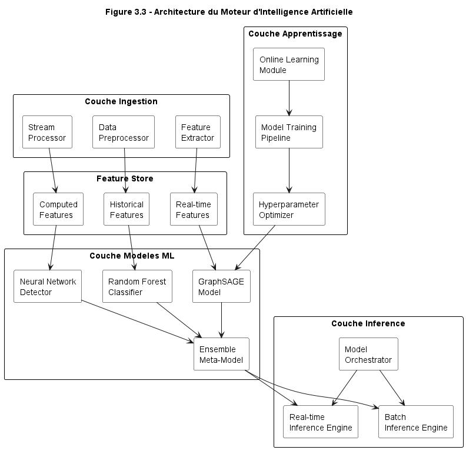

# FraudGuard-360

**Enterprise Real-Time Telecom Fraud Detection Platform**

[](https://github.com/Youss2f/fraudguard-360/actions/workflows/ci.yml)
[](https://github.com/Youss2f/fraudguard-360/actions/workflows/quality.yml)
[](https://github.com/Youss2f/fraudguard-360/actions/workflows/deploy.yml)
[](https://github.com/Youss2f/fraudguard-360)
[](LICENSE)
[](https://www.python.org/)
[](https://kubernetes.io/)

---

## Abstract / Resume

This project presents FraudGuard-360, an enterprise-grade **Telecom Fraud Detection System** designed to identify and prevent fraudulent activities in telecommunications networks in real-time. The platform analyzes Call Detail Records (CDRs) through a multi-stage pipeline combining rule-based risk assessment, machine learning inference, and graph analytics to detect fraud patterns including **Wangiri**, **SIM Box**, **IRSF (International Revenue Share Fraud)**, and **PBX Hacking**.

---

## Overview

FraudGuard-360 is a cloud-native fraud detection platform engineered for telecommunications operators requiring sub-100ms CDR scoring at scale. The system processes Call Detail Records through a multi-stage pipeline combining rule-based risk assessment, machine learning inference, and graph analytics to deliver accurate telecom fraud detection with explainable decisions.

**Performance Design Targets:**
- High-throughput CDR processing via Kafka event streaming
- Low-latency fraud scoring with Redis caching layer
- ML-based fraud detection using PyTorch classification models with attention mechanisms
- Comprehensive test suite with pytest and async testing

> Production benchmarks pending deployment to scaled infrastructure.

**Fraud Types Detected:**
- **Wangiri:** Single-ring callback scams targeting premium rate numbers
- **SIM Box:** Illegal GSM gateways bypassing international termination fees
- **IRSF:** International Revenue Share Fraud via premium number exploitation
- **PBX Hacking:** Unauthorized access to private branch exchanges

---

## Architecture

FraudGuard-360 implements an **Event-Driven Microservices** architecture using Apache Kafka as the central nervous system for asynchronous communication between loosely-coupled services.


### Design Patterns

| Pattern | Implementation | Purpose |
|---------|---------------|---------|
| **Event Sourcing** | Kafka topics with retention | Complete audit trail of all CDRs |
| **Circuit Breaker** | `circuitbreaker` library | Graceful degradation on service failures |
| **CQRS** | Separate read/write paths | Optimized query performance |
| **Saga Pattern** | Kafka-based choreography | Distributed CDR processing management |
| **Bulkhead** | Service isolation | Failure containment |

### Data Flow

1. **Ingestion:** Telecom switch submits CDR -> API Gateway validates and authenticates
2. **Publishing:** Gateway publishes to `raw-cdrs` Kafka topic
3. **Parallel Processing:** Risk Scoring, ML Service, and Graph Analytics consume concurrently
4. **Aggregation:** Scores combined with weighted ensemble
5. **Decision:** Final verdict (LEGITIMATE/SUSPICIOUS/FRAUDULENT) published to `scored-cdrs`
6. **Alerting:** High-risk CDRs trigger `fraud-alerts` for real-time notification

---

## ML & Data Pipeline

The machine learning engine powers real-time telecom fraud detection with state-of-the-art deep learning models and comprehensive feature engineering.



### ML Pipeline Components

| Component | Technology | Description |
|-----------|------------|-------------|
| **Feature Engineering** | NumPy, Pandas | 15+ engineered features from raw CDR data |
| **Model Architecture** | PyTorch | Deep neural network with attention mechanisms |
| **Inference Engine** | FastAPI + ONNX | Sub-50ms real-time predictions |
| **Model Registry** | Internal versioning | A/B testing and rollback capabilities |

### Model Design

| Component | Description |
|-----------|-------------|
| **Architecture** | Deep neural network with attention mechanism and residual connections |
| **Features** | 19 engineered features (time-based, amount-based, velocity, geographic) |
| **Caching** | Redis-backed prediction cache for repeated patterns |
| **Versioning** | Internal model registry with rollback support |

> Model accuracy metrics will be published after formal evaluation on production-scale datasets.

---

## Quick Start

### Prerequisites

- Docker Desktop 4.0+ (or Docker Engine 24+ with Compose V2)
- 8GB RAM minimum (16GB recommended)
- 20GB available disk space

### Local Development

```bash
# Clone repository
git clone https://github.com/Youss2f/fraudguard-360.git
cd fraudguard-360

# Copy environment template
cp .env.example .env

# Start all services
docker compose up -d

# Verify deployment (wait ~60s for Kafka initialization)
docker compose ps
```

### Validate Installation

```bash
# Health check
curl -s http://localhost:8000/health | jq

# Expected response:
# {
#   "status": "healthy",
#   "timestamp": "2025-12-05T10:30:00.000Z",
#   "dependencies": { "kafka": "healthy", "redis": "healthy" }
# }
```

### Submit Test CDR

```bash
curl -X POST http://localhost:8000/v1/cdrs \
  -H "Content-Type: application/json" \
  -d '{
    "caller_msisdn": "+212600123456",
    "callee_msisdn": "+33612345678",
    "duration": 45,
    "call_type": "voice",
    "cell_tower_id": "CELL_MAR_001",
    "imei": "352099001761481"
  }'
```

### Access Services

| Service | URL | Description |
|---------|-----|-------------|
| API Gateway | http://localhost:8000 | Main API endpoint |
| API Documentation | http://localhost:8000/docs | OpenAPI/Swagger UI |
| FSOC Dashboard | http://localhost:3001 | Fraud Security Operations Center |
| Prometheus | http://localhost:9090 | Metrics dashboard |
| Grafana | http://localhost:3000 | Visualization (admin/admin) |

### Shutdown

```bash
# Stop services (preserve data)
docker compose down

# Stop and remove all data
docker compose down -v
```

---

## Security & Compliance

FraudGuard-360 is engineered with security as a foundational requirement, implementing defense-in-depth across all layers.

### Authentication & Authorization

| Control | Implementation |
|---------|---------------|
| **Authentication** | JWT tokens with RS256/HS256 signing, configurable expiration |
| **Authorization** | Role-Based Access Control (RBAC) with fine-grained permissions |
| **API Security** | Rate limiting (configurable per endpoint), request throttling |
| **Session Management** | Redis-backed sessions with automatic expiration |

### Data Protection

| Control | Implementation |
|---------|---------------|
| **Encryption in Transit** | TLS 1.3 for all external communications |
| **Encryption at Rest** | Database-level encryption (configurable) |
| **Secrets Management** | Environment variables, Kubernetes Secrets |
| **Data Masking** | PII redaction in logs, configurable field masking |

### Audit & Logging

| Control | Implementation |
|---------|---------------|
| **Structured Logging** | JSON-formatted logs via `structlog` with correlation IDs |
| **Audit Trail** | Immutable Kafka event log for all CDRs |
| **Access Logging** | Complete request/response logging with user attribution |
| **Metrics** | Prometheus metrics for security event monitoring |

### Vulnerability Management

| Control | Implementation |
|---------|---------------|
| **Container Scanning** | Trivy integration in CI/CD pipeline |
| **Dependency Scanning** | Dependabot, Safety, pip-audit |
| **Static Analysis** | Bandit (Python), CodeQL |
| **Base Images** | `python:3.11-slim-bookworm` with non-root user |

### Compliance Readiness

- **ETSI:** European Telecommunications Standards Institute compliance
- **3GPP:** Third Generation Partnership Project standards
- **GSMA:** GSM Association fraud prevention guidelines
- **SOC 2:** Security monitoring, incident response procedures

---

## Deployment

### Kubernetes (Production)

```bash
# Using Helm (recommended)
helm install fraudguard ./helm/fraudguard \
  --namespace fraudguard \
  --create-namespace \
  --set global.environment=production

# Using kubectl
kubectl apply -f infrastructure/kubernetes/production-deployment.yaml
```

### Cloud Infrastructure (OCI)

```bash
cd terraform
cp terraform.tfvars.example terraform.tfvars
# Edit terraform.tfvars with your credentials

terraform init
terraform plan
terraform apply
```

---

## API Reference

| Method | Endpoint | Description |
|--------|----------|-------------|
| `GET` | `/health` | Service health with dependency status |
| `GET` | `/ready` | Kubernetes readiness probe |
| `GET` | `/live` | Kubernetes liveness probe |
| `POST` | `/v1/cdrs` | Submit CDR for fraud analysis |
| `GET` | `/v1/cdrs/{id}` | Retrieve CDR details and fraud score |
| `GET` | `/v1/stats` | CDR statistics and fraud metrics |
| `GET` | `/metrics` | Prometheus metrics endpoint |

Full API documentation: [`docs/api/API_DOCUMENTATION.md`](docs/api/API_DOCUMENTATION.md)

---

## Development

### Running Tests

```bash
# Unit tests
pytest src/ -v --cov=src --cov-report=term-missing

# Security scan
bandit -r src/ -c .bandit
```

### Code Quality

```bash
# Linting
flake8 src/ --max-line-length=100

# Type checking
mypy src/

# Format check
black --check src/
```

---

## Technology Stack

| Layer | Technologies |
|-------|-------------|
| **Application** | Python 3.11, FastAPI 0.115, Uvicorn |
| **ML/AI** | PyTorch 2.5, scikit-learn, NumPy, Pandas |
| **Messaging** | Apache Kafka 3.x |
| **Databases** | PostgreSQL 15, Redis 7, Neo4j 5 |
| **Infrastructure** | Docker, Kubernetes, Helm, Terraform |
| **Observability** | Prometheus, Grafana, structlog |
| **CI/CD** | GitHub Actions |

---

## Repository Structure

> ML model weights, training datasets, and large binary artifacts are managed externally
> and not committed to this repository. The codebase focuses on application logic,
> infrastructure definitions, and configuration.

---

## Contributing

See [CONTRIBUTING.md](CONTRIBUTING.md) for development guidelines and pull request process.

---

## License

MIT License. See [LICENSE](LICENSE) for details.

---

<p align="center">
  <sub>Built for enterprise telecom fraud prevention</sub>
</p>
