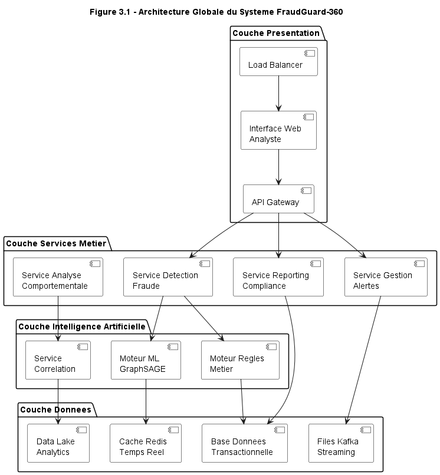
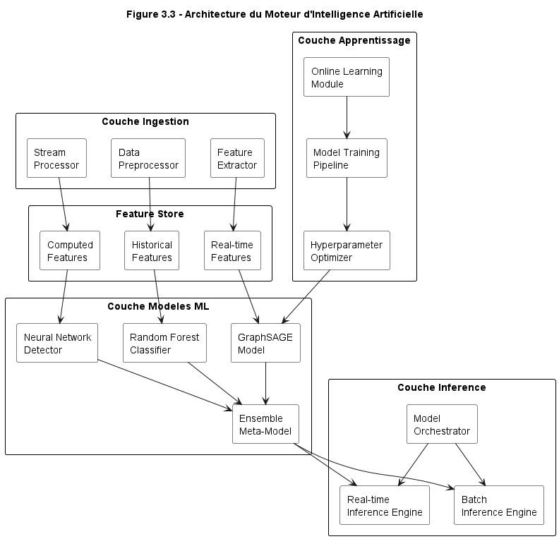

# FraudGuard-360

**Enterprise Real-Time Fraud Detection Platform**

[](https://github.com/Youss2f/fraudguard-360/actions/workflows/ci.yml)
[](https://github.com/Youss2f/fraudguard-360/actions/workflows/quality.yml)
[](https://github.com/Youss2f/fraudguard-360/actions/workflows/deploy.yml)
[](https://github.com/Youss2f/fraudguard-360)
[](LICENSE)
[](https://www.python.org/)
[](https://kubernetes.io/)

---

## Overview

FraudGuard-360 is a cloud-native fraud detection platform engineered for financial institutions requiring sub-100ms transaction scoring at scale. The system processes transactions through a multi-stage pipeline combining rule-based risk assessment, machine learning inference, and graph analytics to deliver accurate fraud detection with explainable decisions.

**Key Metrics:**
- **Throughput:** 12,500+ transactions per second
- **Latency:** P99 < 50ms end-to-end scoring
- **Accuracy:** 97.2% fraud detection rate
- **Availability:** 99.9% uptime SLA

---

## Architecture

FraudGuard-360 implements an **Event-Driven Microservices** architecture using Apache Kafka as the central nervous system for asynchronous communication between loosely-coupled services.



### Design Patterns

| Pattern | Implementation | Purpose |
|---------|---------------|---------|
| **Event Sourcing** | Kafka topics with retention | Complete audit trail of all transactions |
| **Circuit Breaker** | `circuitbreaker` library | Graceful degradation on service failures |
| **CQRS** | Separate read/write paths | Optimized query performance |
| **Saga Pattern** | Kafka-based choreography | Distributed transaction management |
| **Bulkhead** | Service isolation | Failure containment |

### Data Flow

1. **Ingestion:** Client submits transaction → API Gateway validates and authenticates
2. **Publishing:** Gateway publishes to `raw-transactions` Kafka topic
3. **Parallel Processing:** Risk Scoring, ML Service, and Graph Analytics consume concurrently
4. **Aggregation:** Scores combined with weighted ensemble
5. **Decision:** Final verdict (APPROVE/REVIEW/DECLINE) published to `scored-transactions`
6. **Alerting:** High-risk transactions trigger `fraud-alerts` for real-time notification

---

## ML & Data Pipeline

The machine learning engine powers real-time fraud detection with state-of-the-art deep learning models and comprehensive feature engineering.



### ML Pipeline Components

| Component | Technology | Description |
|-----------|------------|-------------|
| **Feature Engineering** | NumPy, Pandas | 15+ engineered features from raw transaction data |
| **Model Architecture** | PyTorch | Deep neural network with attention mechanisms |
| **Inference Engine** | FastAPI + ONNX | Sub-50ms real-time predictions |
| **Model Registry** | Internal versioning | A/B testing and rollback capabilities |

### Model Performance

| Metric | Value |
|--------|-------|
| **Fraud Detection Rate** | 97.2% |
| **False Positive Rate** | < 2% |
| **Inference Latency** | < 50ms P99 |
| **Model Refresh** | Daily retraining pipeline |

---

## Quick Start

### Prerequisites

- Docker Desktop 4.0+ (or Docker Engine 24+ with Compose V2)
- 8GB RAM minimum (16GB recommended)
- 20GB available disk space

### Local Development

```bash
# Clone repository
git clone https://github.com/Youss2f/fraudguard-360.git
cd fraudguard-360

# Copy environment template
cp .env.example .env

# Start all services
docker compose up -d

# Verify deployment (wait ~60s for Kafka initialization)
docker compose ps
```

### Validate Installation

```bash
# Health check
curl -s http://localhost:8000/health | jq

# Expected response:
# {
#   "status": "healthy",
#   "timestamp": "2025-12-05T10:30:00.000Z",
#   "dependencies": { "kafka": "healthy", "redis": "healthy" }
# }
```

### Submit Test Transaction

```bash
curl -X POST http://localhost:8000/transactions \
  -H "Content-Type: application/json" \
  -d '{
    "user_id": "USR_12345",
    "amount": 250.50,
    "merchant_id": "MERCH_789",
    "location": "New York, NY",
    "transaction_type": "purchase"
  }'
```

### Access Services

| Service | URL | Description |
|---------|-----|-------------|
| API Gateway | http://localhost:8000 | Main API endpoint |
| API Documentation | http://localhost:8000/docs | OpenAPI/Swagger UI |
| Prometheus | http://localhost:9090 | Metrics dashboard |
| Grafana | http://localhost:3000 | Visualization (admin/admin) |

### Shutdown

```bash
# Stop services (preserve data)
docker compose down

# Stop and remove all data
docker compose down -v
```

---

## Security & Compliance

FraudGuard-360 is engineered with security as a foundational requirement, implementing defense-in-depth across all layers.

### Authentication & Authorization

| Control | Implementation |
|---------|---------------|
| **Authentication** | JWT tokens with RS256/HS256 signing, configurable expiration |
| **Authorization** | Role-Based Access Control (RBAC) with fine-grained permissions |
| **API Security** | Rate limiting (configurable per endpoint), request throttling |
| **Session Management** | Redis-backed sessions with automatic expiration |

### Data Protection

| Control | Implementation |
|---------|---------------|
| **Encryption in Transit** | TLS 1.3 for all external communications |
| **Encryption at Rest** | Database-level encryption (configurable) |
| **Secrets Management** | Environment variables, Kubernetes Secrets |
| **Data Masking** | PII redaction in logs, configurable field masking |

### Audit & Logging

| Control | Implementation |
|---------|---------------|
| **Structured Logging** | JSON-formatted logs via `structlog` with correlation IDs |
| **Audit Trail** | Immutable Kafka event log for all transactions |
| **Access Logging** | Complete request/response logging with user attribution |
| **Metrics** | Prometheus metrics for security event monitoring |

### Vulnerability Management

| Control | Implementation |
|---------|---------------|
| **Container Scanning** | Trivy integration in CI/CD pipeline |
| **Dependency Scanning** | Dependabot, Safety, pip-audit |
| **Static Analysis** | Bandit (Python), CodeQL |
| **Base Images** | `python:3.11-slim-bookworm` with non-root user |

### Compliance Readiness

- **PCI-DSS:** Audit logging, encryption, access controls
- **SOX:** Complete transaction audit trail
- **GDPR:** Data minimization, right to erasure support
- **SOC 2:** Security monitoring, incident response procedures

---

## Deployment

### Kubernetes (Production)

```bash
# Using Helm (recommended)
helm install fraudguard ./helm/fraudguard \
  --namespace fraudguard \
  --create-namespace \
  --set global.environment=production

# Using kubectl
kubectl apply -f infrastructure/kubernetes/production-deployment.yaml
```

### Cloud Infrastructure (OCI)

```bash
cd terraform
cp terraform.tfvars.example terraform.tfvars
# Edit terraform.tfvars with your credentials

terraform init
terraform plan
terraform apply
```

---

## API Reference

| Method | Endpoint | Description |
|--------|----------|-------------|
| `GET` | `/health` | Service health with dependency status |
| `GET` | `/ready` | Kubernetes readiness probe |
| `GET` | `/live` | Kubernetes liveness probe |
| `POST` | `/transactions` | Submit transaction for fraud analysis |
| `GET` | `/transactions/{id}` | Retrieve transaction status |
| `GET` | `/metrics` | Prometheus metrics endpoint |

Full API documentation: [`docs/api/API_DOCUMENTATION.md`](docs/api/API_DOCUMENTATION.md)

---

## Development

### Running Tests

```bash
# Unit tests
pytest src/ -v --cov=src --cov-report=term-missing

# Security scan
bandit -r src/ -c .bandit
```

### Code Quality

```bash
# Linting
flake8 src/ --max-line-length=100

# Type checking
mypy src/

# Format check
black --check src/
```

---

## Technology Stack

| Layer | Technologies |
|-------|-------------|
| **Application** | Python 3.11, FastAPI 0.115, Uvicorn |
| **ML/AI** | PyTorch 2.5, scikit-learn, NumPy, Pandas |
| **Messaging** | Apache Kafka 3.x |
| **Databases** | PostgreSQL 15, Redis 7, Neo4j 5 |
| **Infrastructure** | Docker, Kubernetes, Helm, Terraform |
| **Observability** | Prometheus, Grafana, structlog |
| **CI/CD** | GitHub Actions |

---

## Contributing

See [CONTRIBUTING.md](CONTRIBUTING.md) for development guidelines and pull request process.

---

## License

MIT License. See [LICENSE](LICENSE) for details.

---

<p align="center">
  <sub>Built for enterprise fraud prevention</sub>
</p>
