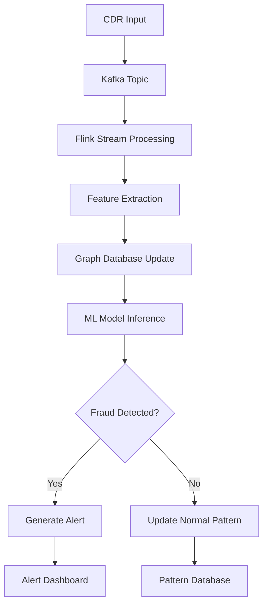

# 🏗️ FraudGuard 360° Architecture Documentation

## 📋 Table of Contents

- [System Overview](#system-overview)
- [Architecture Principles](#architecture-principles)
- [Component Architecture](#component-architecture)
- [Data Flow Architecture](#data-flow-architecture)
- [Security Architecture](#security-architecture)
- [Deployment Architecture](#deployment-architecture)
- [Scalability Considerations](#scalability-considerations)

## 🎯 System Overview

FraudGuard 360° implements a **modern microservices architecture** designed for real-time fraud detection in telecommunications networks. The system processes Call Detail Records (CDRs) using advanced Graph Neural Networks to identify fraudulent patterns with high accuracy and sub-second response times.

### Core Design Principles

1. **Event-Driven Architecture**: Asynchronous processing using Apache Kafka
2. **Microservices Pattern**: Loosely coupled, independently deployable services
3. **Cloud-Native Design**: Container-first with Kubernetes orchestration
4. **Real-Time Processing**: Stream processing with Apache Flink
5. **Graph-Based Analysis**: Neo4j for complex relationship analysis
6. **ML-First Approach**: TensorFlow/PyTorch for advanced fraud detection

## 🏛️ Architecture Principles

### 1. Separation of Concerns
Each service has a single, well-defined responsibility:
- **API Gateway**: Authentication, routing, rate limiting
- **Stream Processor**: Real-time CDR processing
- **ML Service**: Fraud detection and model inference
- **Frontend**: User interface and visualization
- **Graph Database**: Relationship storage and analysis

### 2. Scalability by Design
- Horizontal scaling capabilities for all services
- Stateless service design for easy replication
- Load balancing with automatic service discovery
- Caching strategies for performance optimization

### 3. Resilience and Fault Tolerance
- Circuit breaker patterns for service communication
- Graceful degradation during failures
- Automatic retry mechanisms with exponential backoff
- Health checks and self-healing capabilities

### 4. Security-First Approach
- Zero-trust security model
- End-to-end encryption for sensitive data
- Role-based access control (RBAC)
- API security with JWT tokens
- Network segmentation and firewall rules

## 🔧 Component Architecture

```
┌─────────────────────────────────────────────────────────────────┐
│                        FraudGuard 360° Architecture             │
└─────────────────────────────────────────────────────────────────┘

┌─────────────────┐    ┌──────────────────┐    ┌─────────────────┐
│   Frontend      │────│   API Gateway    │────│   ML Service    │
│   (React)       │    │   (FastAPI)      │    │   (GraphSAGE)   │
│                 │    │                  │    │                 │
│ • Dashboard     │    │ • Authentication │    │ • Model Inference│
│ • Visualizations│    │ • Rate Limiting  │    │ • Training Pipeline│
│ • Real-time UI  │    │ • Request Routing│    │ • Feature Engineering│
└─────────────────┘    └──────────────────┘    └─────────────────┘
         │                       │                        │
         │                       │                        │
         └───────────────────────┼────────────────────────┘
                                 │
                       ┌────────▼────────┐
                       │   Message Bus   │
                       │   (Apache Kafka)│
                       │                 │
                       │ • Event Streaming│
                       │ • Message Queuing│
                       │ • Pub/Sub Pattern│
                       └─────────────────┘
                                 │
                       ┌────────▼────────┐      ┌───────────────┐
                       │  Stream Processor│──────│  Graph Store  │
                       │  (Apache Flink) │      │   (Neo4j)     │
                       │                 │      │               │
                       │ • Real-time ETL │      │ • Graph Analysis│
                       │ • Windowing     │      │ • Relationship │
                       │ • Aggregations  │      │   Mapping     │
                       └─────────────────┘      │ • APOC Procedures│
                                                └───────────────┘
```

### Frontend Service (React + TypeScript)

**Technology Stack:**
- React 18 with hooks and functional components
- TypeScript for type safety
- Cytoscape.js for graph visualization
- Material-UI for consistent design
- WebSocket for real-time updates

**Key Components:**
```typescript
├── components/
│   ├── FraudDetectionDashboard.tsx    # Main dashboard
│   ├── GraphVisualizer.tsx            # Network graph component
│   ├── AlertManager.tsx               # Alert management
│   └── RealTimeMetrics.tsx            # Live metrics display
├── hooks/
│   ├── useWebSocket.ts                # WebSocket connection
│   ├── useFraudData.ts                # Data fetching
│   └── useGraphData.ts                # Graph data management
└── services/
    ├── ApiService.ts                  # API communication
    └── WebSocketService.ts            # Real-time communication
```

### API Gateway (FastAPI)

**Technology Stack:**
- FastAPI with async/await support
- Pydantic for data validation
- JWT for authentication
- Redis for session storage
- Prometheus for metrics

**Service Structure:**
```python
├── app/
│   ├── main.py                        # Application entry point
│   ├── auth.py                        # Authentication logic
│   ├── routers/
│   │   ├── fraud_detection.py         # Fraud detection endpoints
│   │   ├── alerts.py                  # Alert management
│   │   └── analytics.py               # Analytics endpoints
│   ├── models/
│   │   ├── schemas.py                 # Pydantic models
│   │   └── database.py                # Database models
│   └── services/
│       ├── fraud_service.py           # Business logic
│       └── kafka_producer.py          # Message publishing
```

### ML Service (PyTorch + GraphSAGE)

**Technology Stack:**
- PyTorch for deep learning
- NetworkX for graph operations
- Scikit-learn for preprocessing
- FastAPI for model serving
- MLflow for model versioning

**Architecture:**
```python
├── models/
│   ├── graphsage.py                   # GraphSAGE implementation
│   ├── feature_engineering.py        # Feature extraction
│   └── preprocessing.py               # Data preprocessing
├── training/
│   ├── train.py                       # Training pipeline
│   ├── hyperparameter_tuning.py      # Parameter optimization
│   └── model_validation.py           # Cross-validation
├── inference/
│   ├── server.py                      # Inference API
│   ├── batch_inference.py            # Batch processing
│   └── real_time_inference.py        # Real-time processing
```

### Stream Processing (Apache Flink)

**Technology Stack:**
- Apache Flink 1.17
- Java 11
- Kafka connectors
- Neo4j sink connectors

**Processing Pipeline:**
```java
src/main/java/com/fraudguard/
├── GraphProcessingJob.java            # Main Flink job
├── operators/
│   ├── FraudFeatureEnrichment.java    # Feature enrichment
│   ├── CallPatternDetector.java       # Pattern detection
│   └── AnomalyDetector.java           # Anomaly detection
├── sinks/
│   ├── Neo4jSink.java                 # Neo4j connector
│   └── KafkaAlertSink.java            # Alert publishing
└── models/
    ├── CDR.java                       # CDR data model
    └── FraudAlert.java                # Alert model
```

## 🌊 Data Flow Architecture

### 1. CDR Ingestion Flow

```
┌─────────────┐    ┌─────────────┐    ┌─────────────┐    ┌─────────────┐
│   Telecom   │────│   Kafka     │────│   Flink     │────│   Neo4j     │
│   Systems   │    │   Topic     │    │  Processor  │    │  Database   │
└─────────────┘    └─────────────┘    └─────────────┘    └─────────────┘
      │                    │                   │                   │
      │ CDR Events         │ Stream Processing │ Graph Storage     │
      │ (JSON/Avro)        │ (Windowing)       │ (Relationships)   │
      └────────────────────┴───────────────────┴───────────────────┘
```

### 2. Fraud Detection Flow

```
┌─────────────┐    ┌─────────────┐    ┌─────────────┐    ┌─────────────┐
│   Graph     │────│   ML        │────│   Alert     │────│  Frontend   │
│   Query     │    │   Model     │    │   Service   │    │  Dashboard  │
└─────────────┘    └─────────────┘    └─────────────┘    └─────────────┘
      │                    │                   │                   │
      │ Feature Vector     │ Fraud Score       │ Real-time Alert   │
      │ (Node Embeddings)  │ (0.0 - 1.0)       │ (WebSocket)       │
      └────────────────────┴───────────────────┴───────────────────┘
```

### 3. Real-Time Processing Pipeline



## 🔒 Security Architecture

### 1. Network Security

```
┌─────────────────────────────────────────────────────────────────┐
│                        Security Layers                          │
├─────────────────────────────────────────────────────────────────┤
│ Layer 7: Application Security (RBAC, Input Validation)         │
│ Layer 6: API Security (JWT, Rate Limiting, CORS)               │
│ Layer 5: Service Mesh (mTLS, Circuit Breakers)                 │
│ Layer 4: Network Segmentation (VPC, Subnets, Security Groups)  │
│ Layer 3: Infrastructure Security (WAF, DDoS Protection)        │
│ Layer 2: Container Security (Image Scanning, Runtime Security) │
│ Layer 1: Host Security (OS Hardening, Patch Management)        │
└─────────────────────────────────────────────────────────────────┘
```

### 2. Data Security

- **Encryption at Rest**: AES-256 encryption for stored data
- **Encryption in Transit**: TLS 1.3 for all communications
- **Data Anonymization**: PII removal in analytics datasets
- **Access Control**: Fine-grained permissions per service
- **Audit Logging**: Comprehensive security event logging

### 3. Authentication & Authorization

```python
# JWT Token Structure
{
  "sub": "user_id",
  "roles": ["fraud_analyst", "dashboard_viewer"],
  "permissions": [
    "alerts:read",
    "analytics:read", 
    "graph:query"
  ],
  "exp": 1640995200,
  "iat": 1640908800
}
```

## 🚀 Deployment Architecture

### 1. Kubernetes Architecture

```yaml
apiVersion: v1
kind: Namespace
metadata:
  name: fraudguard-production
---
# Production deployment with:
# - 3 replicas minimum for high availability
# - Resource limits and requests
# - Health checks and readiness probes
# - Service mesh integration (Istio)
# - Horizontal Pod Autoscaling (HPA)
```

### 2. Infrastructure as Code

**Terraform Structure:**
```
infrastructure/
├── modules/
│   ├── eks/                          # Kubernetes cluster
│   ├── rds/                          # Managed databases
│   ├── elasticache/                  # Redis caching
│   ├── msk/                          # Managed Kafka
│   └── monitoring/                   # Prometheus/Grafana
├── environments/
│   ├── staging/                      # Staging environment
│   └── production/                   # Production environment
└── shared/
    ├── networking.tf                 # VPC, subnets, gateways
    └── security.tf                   # Security groups, IAM
```

### 3. Multi-Environment Strategy

| Environment | Purpose | Configuration |
|-------------|---------|---------------|
| **Development** | Local development | Docker Compose |
| **Staging** | Integration testing | Single AZ, shared resources |
| **Production** | Live system | Multi-AZ, dedicated resources |
| **DR** | Disaster recovery | Cross-region backup |

## 📈 Scalability Considerations

### 1. Horizontal Scaling

**Auto-scaling Policies:**
```yaml
# API Gateway HPA
spec:
  minReplicas: 3
  maxReplicas: 50
  metrics:
  - type: Resource
    resource:
      name: cpu
      target:
        type: Utilization
        averageUtilization: 70
  - type: Resource
    resource:
      name: memory
      target:
        type: Utilization
        averageUtilization: 80
```

### 2. Database Scaling

**Neo4j Cluster Configuration:**
- **Core Servers**: 3 instances for consensus and replication
- **Read Replicas**: 5+ instances for query load distribution
- **Backup Strategy**: Continuous backup with point-in-time recovery

**Kafka Partitioning Strategy:**
- **CDR Topic**: 24 partitions (1 per hour for time-based processing)
- **Alert Topic**: 6 partitions (by severity level)
- **Replication Factor**: 3 for fault tolerance

### 3. Performance Optimization

**Caching Strategy:**
```
┌─────────────┐    ┌─────────────┐    ┌─────────────┐
│   Browser   │────│   CDN       │────│ Application │
│   Cache     │    │   Cache     │    │   Cache     │
│   (1 hour)  │    │   (24 hours)│    │   (Redis)   │
└─────────────┘    └─────────────┘    └─────────────┘
```

**Database Optimization:**
- Graph database indexing on frequently queried properties
- Query optimization with EXPLAIN PLAN analysis
- Connection pooling and prepared statements
- Read/write splitting for better performance

## 🎯 Monitoring and Observability

### 1. Metrics Collection

**Application Metrics:**
- Request/response times and throughput
- Error rates and success rates
- Business metrics (fraud detection accuracy, false positives)
- Resource utilization (CPU, memory, network)

**Custom Metrics:**
```python
from prometheus_client import Counter, Histogram, Gauge

# Fraud detection metrics
fraud_detections_total = Counter('fraud_detections_total', 'Total fraud detections')
fraud_detection_latency = Histogram('fraud_detection_duration_seconds', 'Fraud detection latency')
active_subscribers = Gauge('active_subscribers_total', 'Number of active subscribers')
```

### 2. Distributed Tracing

**Jaeger Integration:**
- End-to-end request tracing across all services
- Performance bottleneck identification
- Dependency mapping and service communication analysis

### 3. Logging Strategy

**Structured Logging:**
```json
{
  "timestamp": "2024-01-15T10:30:00Z",
  "level": "INFO",
  "service": "fraud-detection",
  "trace_id": "abc123def456",
  "span_id": "xyz789",
  "user_id": "user_12345",
  "action": "fraud_analysis",
  "result": "fraud_detected",
  "fraud_score": 0.87,
  "processing_time_ms": 234
}
```

## 🔄 CI/CD Architecture

### 1. Pipeline Stages

```
┌─────────────┐    ┌─────────────┐    ┌─────────────┐    ┌─────────────┐
│   Source    │────│   Build     │────│    Test     │────│   Deploy    │
│   Control   │    │   & Package │    │   & Scan    │    │   & Monitor │
└─────────────┘    └─────────────┘    └─────────────┘    └─────────────┘
      │                    │                   │                   │
      │ Git Push/PR        │ Docker Build      │ Automated Tests   │ Blue/Green Deploy
      │ Branch Protection  │ Dependency Scan   │ Security Scan     │ Health Checks
      │ Code Review        │ Multi-arch Build  │ Performance Tests │ Rollback Strategy
```

### 2. Quality Gates

**Automated Quality Checks:**
- Code coverage > 85%
- Security vulnerabilities: 0 critical, <5 high
- Performance regression: <10% latency increase
- All tests pass: Unit, Integration, E2E
- Documentation updates included

This architecture provides a robust, scalable, and secure foundation for the FraudGuard 360° fraud detection platform, ensuring high availability, performance, and maintainability in production environments.